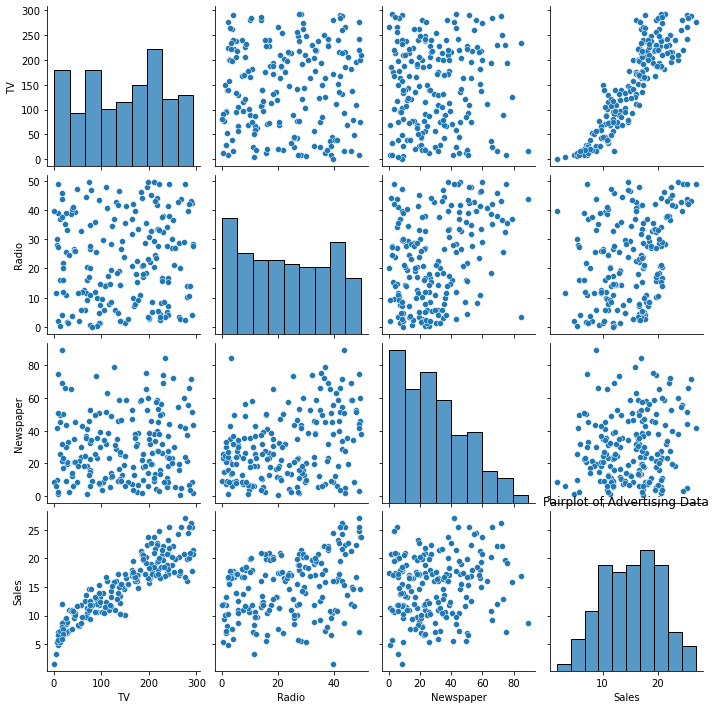
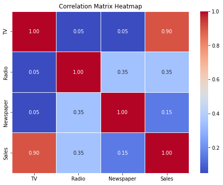

# Sales Prediction 📈 &nbsp; [](SALES%20PREDICTION.ipynb)


> **Forecasting product sales from advertising spend across TV, Radio, and Newspaper channels — achieving R² = 0.913 with Linear Regression.**

<br>

<p align="center">
  
  &nbsp;&nbsp;
  
  &nbsp;&nbsp;
  
</p>

<br>

## Table of Contents

- [Problem Statement](#problem-statement)
- [Dataset](#dataset)
- [Methodology](#methodology)
- [Visualizations](#visualizations)
- [Key Results](#key-results)
- [Technologies Used](#technologies-used)
- [How to Run](#how-to-run)
- [Author](#author)

<br>

## Problem Statement

How should a business allocate its advertising budget to maximize sales? This project builds a **Linear Regression model** to predict product sales based on advertising expenditures across three channels: **TV**, **Radio**, and **Newspaper**. By quantifying the relationship between ad spend and revenue, businesses can optimize their marketing strategies and maximize ROI.

<br>

## Dataset

| Property | Detail |
|----------|--------|
| **Source** | [Advertising Dataset](https://www.kaggle.com/datasets/bumba5341/advertisingcsv) |
| **Size** | 200 observations |
| **Features** | TV, Radio, Newspaper (advertising spend in $thousands) |
| **Target** | `Sales` (units sold, in thousands) |
| **Quality** | No missing values, no duplicates, 2 outliers detected and removed |

### Feature Correlations with Sales

| Channel | Correlation |
|---------|------------|
| **TV** | Strong positive |
| **Radio** | Moderate positive |
| **Newspaper** | Weak positive |

<br>

## Methodology

### 1. Data Cleaning
- Checked for missing values → **0 found**
- Checked for duplicates → **0 found**
- Detected outliers using **IQR method** (1.5× interquartile range) → **2 outliers removed**

```python
def detect_outliers(df, features):
    outlier_indices = []
    for col in features:
        Q1 = df[col].quantile(0.25)
        Q3 = df[col].quantile(0.75)
        IQR = Q3 - Q1
        outlier_step = 1.5 * IQR
        outlier_list_col = df[(df[col] < Q1 - outlier_step) |
                              (df[col] > Q3 + outlier_step)].index
        outlier_indices.extend(outlier_list_col)
    return pd.Series(outlier_indices)
```

### 2. Exploratory Data Analysis
- **Pairplot** — visualized pairwise relationships across all features
- **Correlation Heatmap** — confirmed TV as the strongest predictor of sales
- **Distribution analysis** — examined feature spread and normality

<p align="center">
  
</p>
<p align="center"><em>Pairplot revealing the strong linear relationship between TV spend and Sales</em></p>

<p align="center">
  
</p>
<p align="center"><em>Correlation matrix — TV advertising shows 0.90 correlation with Sales</em></p>

### 3. Model Training
- **Algorithm:** Linear Regression
- **Split:** 80/20 train-test split (`random_state=42`)
- **Features:** TV, Radio, Newspaper advertising spend

```python
X = df[['TV', 'Radio', 'Newspaper']]
y = df['Sales']

X_train, X_test, y_train, y_test = train_test_split(X, y, test_size=0.2, random_state=42)

model = LinearRegression()
model.fit(X_train, y_train)
```

### 4. Model Evaluation
- Evaluated using **Mean Squared Error (MSE)** and **R-squared (R²)**

<br>

## Key Results

| Metric | Value | Interpretation |
|--------|-------|----------------|
| **R² Score** | **0.913** | 91.3% of sales variance explained by ad spend |
| **MSE** | **2.416** | Average squared prediction error |
| **RMSE** | **1.555** | Predictions off by ~$1,555 in sales units |

### What This Means
The model explains **91.3%** of the variance in sales using advertising expenditures alone. This strong fit indicates that advertising spend — particularly TV — is a reliable predictor of sales performance.

### Key Takeaways
- **TV advertising** has the strongest impact on sales
- **Radio** provides a moderate boost
- **Newspaper** advertising has minimal predictive value
- A simple linear model captures the relationship effectively

<br>

## Technologies Used

| Tool | Purpose |
|------|---------|
| Python 3.x | Core language |
| Pandas 1.3 | Data loading & manipulation |
| Scikit-learn 0.24 | Linear Regression, train-test split, metrics |
| Matplotlib 3.4 | Visualization |
| Seaborn 0.11 | Statistical plots & heatmaps |
| Jupyter Notebook | Interactive development |

<br>

## How to Run

```bash
# Clone the repository
git clone https://github.com/ouyale/Sales-Prediction-v2.git
cd Sales-Prediction-v2

# Install dependencies
pip install numpy==1.21.2 pandas==1.3.3 scikit-learn==0.24.2 matplotlib==3.4.3 seaborn==0.11.2

# Launch the notebook
jupyter notebook "SALES PREDICTION.ipynb"
```

<br>

## Author

**Barbara Obayi** — Machine Learning Engineer

[](https://github.com/ouyale)
[](https://www.linkedin.com/in/barbara-weroba-obayi31/)
[](https://ouyale.github.io)

---
